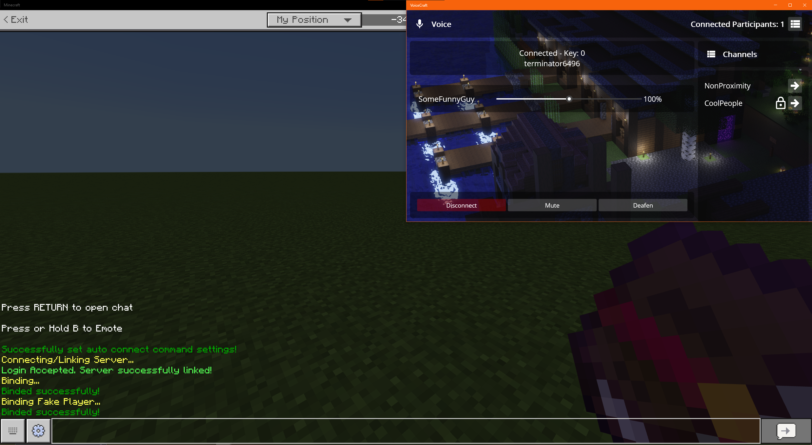

# VoiceCraftProximityChat

Standalone Proximity Voice chat for Minecraft Bedrock Edition.

THIS VERSION DOES NOT REQUIRE THE USE OF DISCORD OR ANY THIRD PARTY VC SOFTWARE. EVERYTHING IS BUILT-IN AND WORKS WITH THE VANILLA BDS SOFTWARE.

## Project Description
VoiceCraft proximity chat is a VOIP program developed on .NET 8.0 MAUI framework and .NET 7.0 Console, started by SineVector241, this project enables Voice Proximity chat for the game Minecraft on the bedrock platform which gives a more immersive, communicative experience. This project will also expand into supporting more platforms such as IOS and MAC devices. This project only allows for a self-hosted framework giving the owners more control on how they want it to be setup however the project may also expand into allowing multiple server instances on a single server that does not require a self-hosted framework and allows other users to host for other Minecraft server owners.

## Other VoiceCraft Resources
https://github.com/SineVector241/VoiceCraft-MCBE_ProximityChat_Addon
https://github.com/SineVector241/VoiceCraft-MCBE_Proximity_Chat_Docker/pkgs/container/voicecraft
https://hub.docker.com/r/sinevector241/voicecraft/tags

## Installation Guide
Please refer to the [wiki](https://github.com/SineVector241/VoiceCraft-MCBE_Proximity_Chat/wiki) for installations.

## Discord Server

## Pictures

ANDROID PICTURES TO-DO
